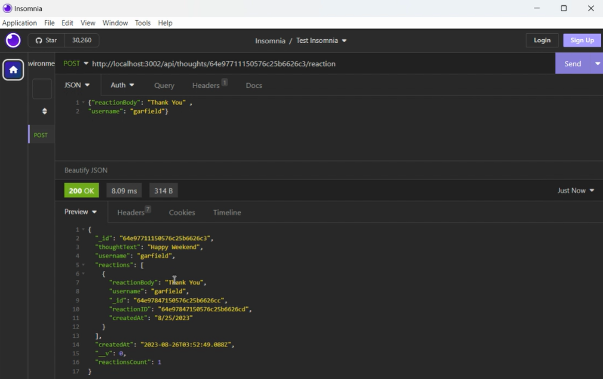

#NoSQL: Social Network API
  

  ### Table of Content
  * [Description](#description)
  * [Installation](#installation)
  * [Usage](#usage)
  * [Contributing](#contributing)
  * [Developer Information](#developer-information)
  * [License](#license)

  ### Description:
  The project is an assignment of a coding bootcamp program, with the purpose for students learn how to use NoSQL and Mongoose. The application is a social network API where users can interact by creating accounts, sharing their thoughts, adding other users to their friends list, and adding reactions to other users thoughts.

  ### Installation:
  - Clone the initial code git repository.
  - Install Insomnia and MongoDB to the machine if not already installed.
  - Navigate on the terminal to the directory social-network where the code was cloned to.
  - Type "npm i", "node ./seeds/seeds.js" and "npm start".

  ### Usage:
  [Click here](https://drive.google.com/file/d/1pqqa-XCoU99IAJY0qNJvDcsDO7AThHPK/view) to watch a demo on how to use and test the application on Insomnia. 
  - Open Insomnia
  - Select "GET", then type and send "localhost:3002/api/users" to see all the users and "localhost:3002/api/thoughts" to see all the thoughts.
  - Select "POST", then type "localhost:3002/api/users" in the route form and type "{"username": "placeholder","email": "placeholder"}" with your desired placeholders in the JSON form and click "send" to add a new user.
  - Select "PUT", then type "localhost:3002/api/users/:userId" in the route form and type "{"username": "placeholder","email": "placeholder"}" with your desired placeholders in the JSON form and click "send" to replace an existing user.
  - Select "POST", then type "localhost:3002/api/thoughts" in the route form and type "{"thoughtText": "placeholder","username": "placeholder"}" with your desired placeholders in the JSON form and click "send" to add a new thought.
  - Select "PUT", then type "localhost:3002/api/thoughts/:thoughtId" in the route form and type "{"thoughtText": "placeholder","username": "placeholder"}" with your desired placeholders in the JSON form and click "send" to replace an existing thought.
  - Select "POST", then type "localhost:3002/api/users/:userId/friends/:friendId" in the route form and click "send" to add a friend to a user's list of friends.
  - Select "POST", then type "localhost:3002/api/thoughts/:thoughtId/reaction" in the route form and type "{"reactionBody": "placeholder","username": "placeholder"}" with your desired placeholders in the JSON form and click "send" to add a reaction to the thought of a friend.
  - Select "DELETE", then type "localhost:3002/api/thoughts/:thoughtId/reaction/:reactionId" in the route form and click "send" to delete a reaction to the thought of a friend.
  - Select "DELETE", then type "localhost:3002/api/users/:userId/friends/:friendId" in the route form and click "send" to delete a user from another user's friend's list.
  - Select "DELETE", then type "localhost:3002/api/thoughts/:thoughtId" in the route form and click "send" to delete a user's thought'.
  - Select "DELETE", then type "localhost:3002/api/users/:userId" in the route form and click "send" to delete a user's account'.

  
  

  ### Contributing
  I have received advice from the UC Berkeley Extension tutors Henry Weigand on pseudocoding and Matthew Calimbas on debugging and testing my code. I also reached out to the [Mozilla Developer](https://developer.mozilla.org/en-US/) webpage and [NPM Docs](https://docs.npmjs.com/) for documentation.

  ### Developer Information:
  - Virginia Freitas
  - GitHub URL: https://github.com/virginiafreitas
  - e-mail address: virginiacdefreitas@gmail.com

  ### License:
  The application is covered under the MIT license.
